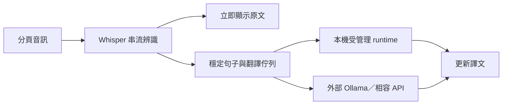
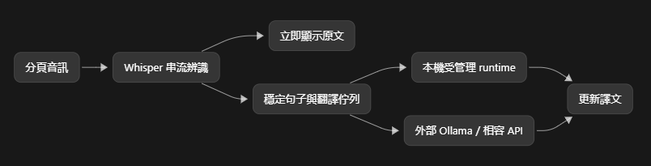

# Whisper 串流字幕與翻譯架構

此圖記錄架構討論的設計方向，不代表所有元件已完成實作。

## Mermaid 原始圖

本機與外部翻譯是可選的執行路徑，同一工作階段依設定選用其中一條。

## 圖片版本

圖片保留討論時的外觀；後續調整架構時，請同步更新 Mermaid 與圖片。

## 2026-09-12 實作更新

原始圖片保留作為討論記錄；目前 GUI、擴充功能與後端的分工，以及更新的 Mermaid 流程，見 [翻譯服務設計](TRANSLATION_SERVICES.md)。
