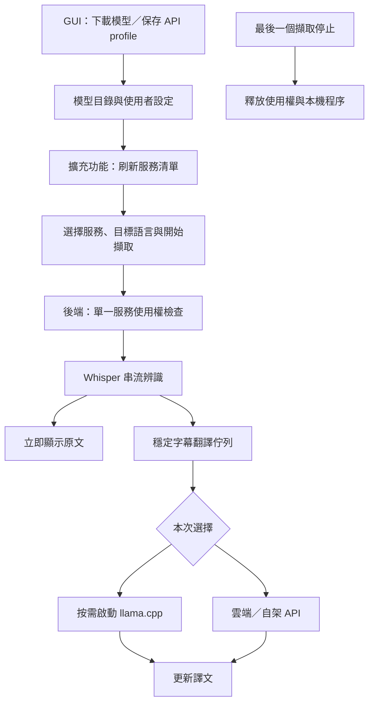

# 翻譯服務與模型選擇（2026-09-13）

GUI 統一管理模型檔案、API 連線及桌面預設；擴充功能讀取後端清單，選擇下一次擷取使用的模型與語言。
下載模型或儲存雲端設定，都不代表開始推論。

桌面 GUI 以職責區分兩個翻譯入口：**Local translation** 下載並管理本機 GGUF 與
內建 llama.cpp runtime；**Translation services** 保存雲端或自架服務的連線 profile，
並顯示舊版 NLLB adapter 以維持相容。
兩者都提供翻譯能力，但前者管理本機資產，後者管理服務連線。

模型儲存位置統一在 **Settings → Model storage** 設定。Windows 預設根目錄為
`%APPDATA%\Live Subtitle`，Whisper 放在 `Speech models\`，本機翻譯模型、runtime 與下載暫存放在
`Local Translation Models\`。首次啟動會複製舊 `%APPDATA%\STT-TTS\config.yaml`，但不刪除舊目錄，
也不重寫其中既有的模型路徑，因此不會強迫搬移或重新下載大型模型。

## 使用流程

1. 更新後重啟 GUI，並在 `chrome://extensions` 重新載入擴充功能。
2. 本機模型：在 **Local translation** 選擇模型，按 **Download model**。
   自訂模型可按 **Add Hugging Face GGUF…**，填入公開 repository 與 GGUF 檔案路徑。
   分片模型填任一片，程式會解析同組分片並下載完整檔案。
3. 雲端／自架服務：在 **Translation services** 新增或編輯服務，填入 endpoint、
   API key 與 model，按 **Save defaults**。API 類型等設定位於進階資料；原有 vLLM
   啟動指令產生器保留為進階工具。需要沿用該服務時，勾選桌面預設選項。
4. 啟動後端，待 GUI 顯示 **Ready**。擴充功能開啟時及保持開啟期間會同步清單，
   也可按清單旁的刷新圖示。STT 與翻譯模型都來自後端；未安裝或已移除的項目不可直接啟動。
   舊版擴充功能自行保存的 profiles 可在 Options 的匯入區塊移入桌面設定。
   匯入成功後才更新選中 ID；失敗項目可重試，原有資料保留作為復原來源。
5. 目標語言可輸入名稱或語言代碼，例如 `Kiswahili`、`es-MX`、`粵語（香港）`。
   下拉建議只是快捷選項；不會把既有 `zh-CN` 改為 `zh-TW`。
6. Popup 可沿用桌面的 STT、語言及翻譯行為，或設定明確的覆寫值。按 **Start capture**，
   本機模型此時才載入，完成健康與短句翻譯檢查後開始 STT。
   最後一個使用該翻譯模型的擷取停止時，後端會結束並回收自己啟動的 llama.cpp 程序。

同時擷取的分頁可以使用同一個服務／模型，並指定不同目標語言。切換到另一個模型或
雲端服務前，必須停止原本的擷取；後端會拒絕衝突選擇，並且不會偷偷換用其他服務。
選單更動套用在下一次擷取，不會中途改變正在產生的字幕。
**None** 僅做語音辨識，可與其他分頁的翻譯共存。

GUI 與擴充功能各自提供 Light／Dark／System 主題並記住偏好。Popup 保留擷取操作，
字幕大小、背景透明度、歷史行數及舊 profiles 匯入位於 Options。
GUI 顯示未儲存變更與生效時機；Host／Port 需重啟，服務與預設設定供新擷取使用。
若設定已被另一個介面更新，過期的儲存會被拒絕，需重新載入後再編輯，避免覆蓋新服務。

**Remove from extension choices** 取消模型在新擷取選單中的可用狀態，保留已下載檔案。
已經啟動的擷取仍需按停止。這不是刪除權重功能。

## 較新的模型

以下大小是此專案固定版本的 GGUF 下載量，**不是完整推論顯存需求**。
Whisper、KV cache、runtime 與其他程式都需要額外記憶體。8GB 設備應從小模型與較小
Whisper 開始，並接受啟動時的記憶體檢查；3090 24GB 可再實測較大模型的品質與延遲。

| 模型 | GGUF 來源 | Q4_K_M 下載 | 目前狀態 |
|---|---|---:|---|
| Qwen3 4B | [Qwen 官方 GGUF](https://huggingface.co/Qwen/Qwen3-4B-GGUF) | 2.33 GiB | 已加入選單；完整下載版本與 SHA256 已固定，尚未在本次工作實跑 |
| Qwen3.5 2B | [Unsloth GGUF](https://huggingface.co/unsloth/Qwen3.5-2B-GGUF)，[Qwen 原始模型](https://huggingface.co/Qwen/Qwen3.5-2B) | 1.19 GiB | 已加入；RTX 3080 10GB 通過下載校驗、CUDA 載入、短句翻譯及停止程序 |
| Qwen3.5 4B | [Unsloth GGUF](https://huggingface.co/unsloth/Qwen3.5-4B-GGUF)，[Qwen 原始模型](https://huggingface.co/Qwen/Qwen3.5-4B) | 2.55 GiB | 已加入；尚未在本次工作實跑 |
| Gemma 4 E2B | [Google 官方模型卡](https://ai.google.dev/gemma/docs/core/model_card_4) | 本次未固定下載版本 | 後續候選；E2B 是有效參數量，含 embedding 的總參數較大，不能直接用「2B」估算顯存 |
| TranslateGemma 4B | [Google 官方模型卡](https://huggingface.co/google/translategemma-4b-it) | 本次未固定下載版本 | 後續翻譯專用 adapter 候選，尚未加入一鍵清單 |

Qwen3／Qwen3.5 在此用途關閉思考模式，以避免把字幕輸出預算耗在思考內容。
本次實測發現僅使用 `--reasoning-budget 0` 仍可能沒有譯文，因此固定 runtime 使用
正式的 `--reasoning off` 參數。[llama.cpp b10919 參數實作](https://github.com/ggml-org/llama.cpp/blob/b10919/common/arg.cpp)

TranslateGemma 與一般聊天 LLM 不同：官方模板只接受 user／assistant，並要求結構化
`source_lang_code`、`target_lang_code`，還會檢查語言支援範圍。因此不能宣稱所有翻譯模型
只改一段通用 prompt 就能直接相容。[官方輸入格式](https://huggingface.co/google/translategemma-4b-it#usage)
NLLB 也保留其 tokenizer 語言代碼契約：未知目標會回報錯誤，不再靜默改譯成中文。

Qwen2.5 的既有兩個選项仍保留，作為比較基準。語言開放輸入不等於每個模型都能可靠
翻譯所有語言；上述新模型也尚未完成 Whisper 並行、3090／8GB 設備、多語言品質基準測試。

## 實作契約

- `backend/local_models.json` 是內建候選目錄；新增候選只需新增資料，不必改 GUI 分支。
- 自訂 HF GGUF 由 API 解析固定 commit、大小、SHA256，保存於使用者設定的
  `local_llama.custom_models`。支援任意公開 repository；不執行 repository 程式碼。
  需要登入／同意授權的 gated repository 與特殊聊天模板，目前不屬於一鍵導入範圍。
- `/asr` 首個訊息 `{type: "desktop_catalog", version: 2}` 回傳 STT／翻譯清單、預設、
  可用狀態、伺服器識別與 revision，不載入 STT／翻譯，也不回傳 API key、API URL 或本機路徑。
  舊版 `translation_catalog` v1 仍保留讀取相容。新版擴充功能遇到舊後端會顯示升級提示。
- 新擷取使用 `translation.selection = {kind: "local" | "profile", id: "..."}`，
  另帶 `target_language`、`partial`；模型與連線設定在後端依 ID 解析。
- 共用 profiles 保存於 `translation.service_profiles`。舊資料遷移經由 v2 管理訊息，
  憑證只出現在匯入要求與後端設定，不進入清單快取。擴充功能不再提供獨立的新增／刪除編輯器。
  推論與測試都經後端路由，確保本機與雲端不會同時被本程式選中。
- `backend/config_store.py` 使用跨程序檔案鎖、原子替換及版本檢查，防止 GUI 儲存舊快照時
  覆蓋擴充功能匯入結果。設定檔中的 `_stt_tts_store` 為儲存層 metadata，載入產品設定時會移除。
- 新擷取的 v2 狀態包含後端實際解析的模型／語言快照；正在擷取的快照與下一次選擇分開顯示。
  `/health` 的程序識別必須符合 GUI 啟動的實例後才顯示 Ready；模型就緒另由擷取狀態回報。
- `translation_service.py` 管理使用權及本機 runtime；同一模型不同語言共用同一個程序。
  切換檢查發生在載入 STT 前，啟動失敗／取消不保留使用權；停止也清理 translator cache。
- 舊設定鍵 `translation.vllm` 與內部 engine 名稱暫時保留作為相容層。
  UI 保存 profile 不再修改目前 engine。既有模型檔案無需重下。
- 本機 runtime 使用隨機程序 token，僅存在後端記憶體，不保存到設定、不傳給擴充功能。
  Windows Job Objects 將已啟動的 llama.cpp 綁定到後端生命週期；正常停止、GUI 關閉與後端被終止時，都會回收所屬程序。

依 anti-hardcode-engineering 分類：語言與模型是開放集合，採自由輸入及資料目錄；
API 種類、訊息種類、GGUF 分片格式是明確協定；vLLM／NLLB 是隔離的相容層。
測試包括未列在建議中的語言、未知供應商與模型名稱、不同分片路徑、缺片、衝突選擇、
實際 WebSocket 路由與取消啟動，避免只覆蓋畫面上的名稱。

## 驗證紀錄

2026-09-13 GUI／擴充功能改版的驗證、畫面及尚待人工確認項目，見
[改版驗收紀錄](implementation/ui-sync-redesign/README.md)；工作項目追蹤見
[GUI／擴充功能改版計畫](UI_SYNC_REDESIGN_PLAN.md)。

下列為 2026-09-12 的歷史基準，不代表改版已完成驗收：

- Python 完整測試：55 項通過（包含既有 backend、GUI 與新增路由測試）。
- Node 測試：5 項通過；執行實際 popup → background → offscreen 程式，驗證本機／API
  選擇與自訂語言最後送出的 WebSocket config。此測試模擬 Chrome 音訊／儲存 API，未播放真實分頁音訊。
- 真正的 PySide6 GUI 已在隔離設定中渲染，檢查本機與服務設定頁；未改動使用者設定。
- Qwen3.5 2B 實際 CUDA smoke 通過，停止後子程序已結束。另以實際父／子程序驗證
  Windows Job Object 的父程序終止收尾；尚未測試 Windows 以外的平台。
- 模型載入期間關閉 WebSocket 會取消載入、收尾程序並釋放使用權；提早送入的音訊有緩衝上限。
